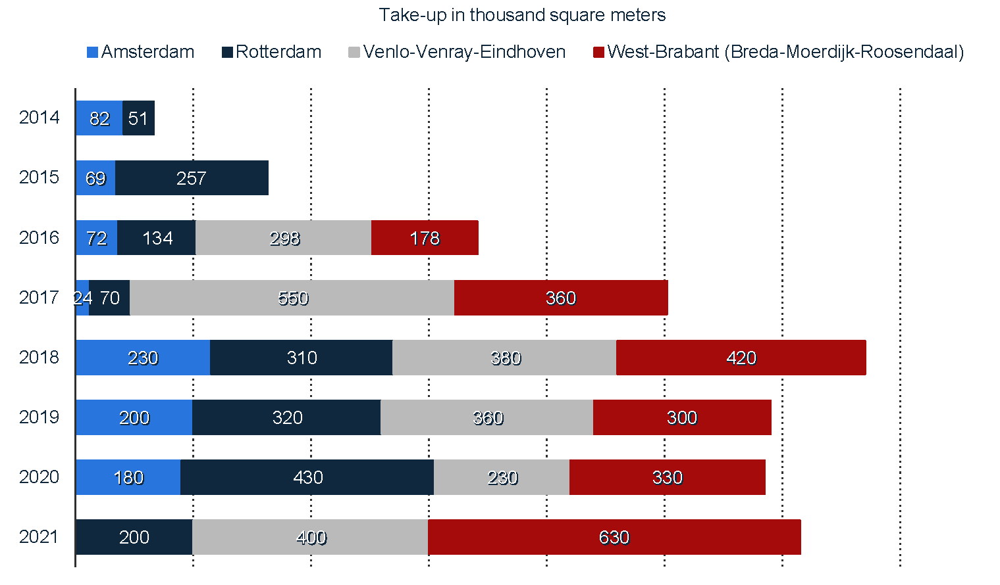

## Research and Industry

<!-- 2. An explanation on how the education connects to ongoing research, or future field of occupation. -->

<!-- Tell us about how your course is at the forefront of innovation and how you keep abreast of new developments while balancing rigor and quality. -->

In recent years, the field of warehousing has been undergoing rapid change due to advancements in technology and increasing demand for efficient and effective supply chain management.

The MSc IEM's **Warehousing** course helps students stay up-to-date with the latest developments and prepare them to take on leadership roles in their future careers.

>Graduates are equipped with a thorough understanding of the latest research and best practices in the field and the knowledge and skills needed to analyze data, optimize warehouse operations, and make informed decisions.

They may work as logistics managers, supply chain analysts, operations managers, or warehouse managers, among other roles.

### Warehouse research

Ongoing research in warehousing is focused on developing new and innovative solutions for optimizing warehouse operations, including the use of automation and artificial intelligence, the implementation of more sophisticated inventory management systems, and the adoption of sustainable practices.

In conclusion, an MSc course in warehousing provides students with a strong foundation in the field and prepares them for careers in an industry that is constantly evolving and offers many opportunities for growth and advancement. The course also helps students stay informed about the latest research and developments in the field, equipping them to make informed decisions and contribute to ongoing efforts to improve the efficiency and effectiveness of warehousing operations.

### Warehousing industry

Graduates of the MSc course in warehousing are well-prepared to meet this demand. They are equipped with a thorough understanding of the latest research and best practices in the field and the knowledge and skills needed to analyze data, optimize warehouse operations, and make informed decisions.

They are also well-positioned to contribute to the ongoing efforts to improve the efficiency and effectiveness of the warehousing industry in the Netherlands.
In conclusion, the MSc course in warehousing and its learning outcomes are directly relevant to the warehousing industry in the Netherlands, providing students with the knowledge and skills needed to succeed in a critical and rapidly evolving sector of the country's economy.

#### Warehousing in the Netherlands {.unnumbered}

The Netherlands is a major logistics and supply chain management hub with a well-developed warehousing industry that plays a critical role in the country's economy.
The number of warehouses in the country has been consistently growing (see @fig-takeup), to keep up with the latest  trends towards online shopping, digitalization, and same- or next-day delivery.
Many companies in the Netherlands operate large warehousing facilities to support their supply chain operations, including major retailers, manufacturers, and logistics.

Consequently, the demand for skilled professionals in the field of warehousing is high, and many companies are seeking individuals with advanced knowledge and skills in warehouse design, operation, and management.

>Given the diversity of the Dutch market, M-IEM students willing to carry out their graduation projects in warehousing related-subjects may choose from a wealth of companies.

::: {#fig-takeup layout-ncol=1 width=80%}

Annual take-up^[Total floor space known to have been let or pre-let (planning/construction stage), sold or pre-sold to tenants or owner-occupiers] rate for warehouses in the Netherlands from 2014 to 2021, by city (source: [Statista](https://www.statista.com/topics/4947/logistics-property-in-the-netherlands/)).
:::

{#fig-wordcloud_abstract width=80%}

### M-IME theses on warehousing {#sec-warehousing-theses}


